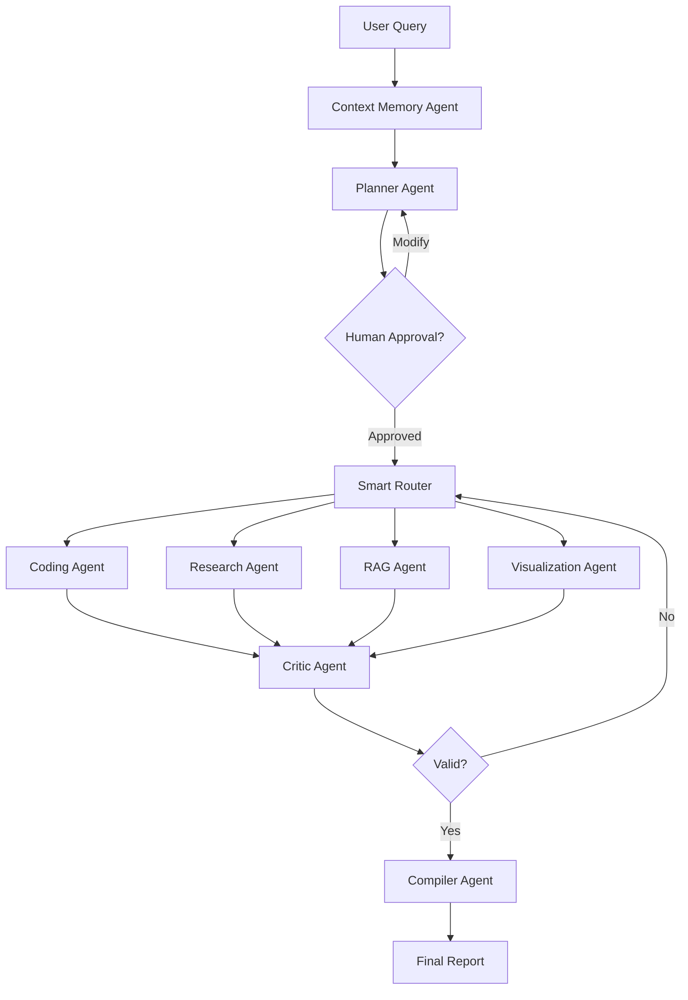
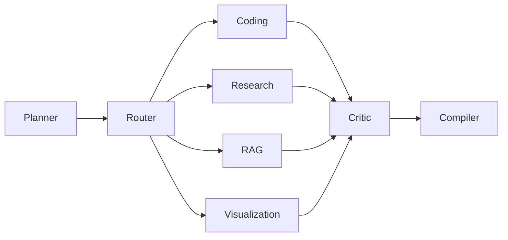
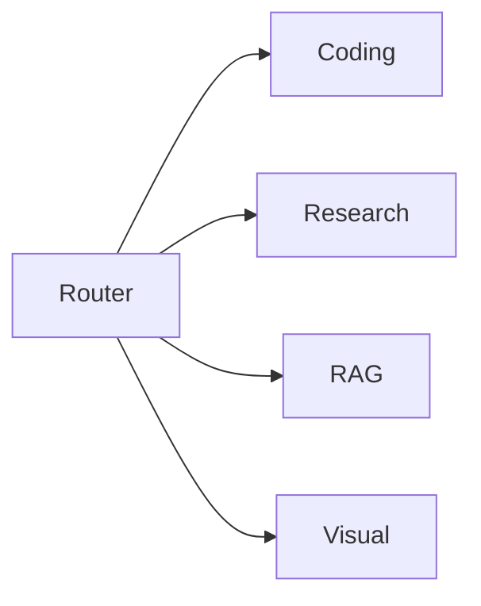
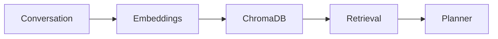
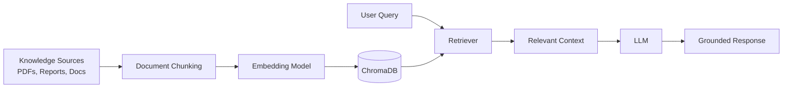

# 🚀 Multi-Agent BI Assistant

<div align="center">

### Planning • Memory • RAG • Research • Data Analysis • Visualization • Reflection

Enterprise-inspired Multi-Agent Business Intelligence Assistant powered by **LangGraph, RAG, ChromaDB, Human-in-the-Loop Workflows, Self-Corrective Reasoning, and Parallel Agent Orchestration**, designed to transform business queries into trustworthy and actionable insights from both **internal** and **external** data sources.


</div>

---

# 🎯 Executive Summary

Modern business questions rarely require a single source of information.

A useful answer often needs:

* Historical company reports
* Internal datasets
* Industry benchmarks
* Current market information
* Visual analytics
* Human validation

Traditional AI systems struggle because they attempt to solve everything using one reasoning process.

This project introduces a **Multi-Agent Business Intelligence Architecture** where specialized agents collaborate to:

✔ Plan

✔ Retrieve Memory

✔ Analyze Data

✔ Conduct Research

✔ Generate Visualizations

✔ Validate Outputs

✔ Produce Final Reports

---

# ❌ Problems With Traditional AI Analytics Systems

| Problem                 | Impact                          |
| ----------------------- | ------------------------------- |
| No memory               | Repeats work every session      |
| Over-routing            | Uses irrelevant data            |
| Weak reasoning          | Poor connection between sources |
| No validation           | Hallucinated insights           |
| No human approval       | Executes blindly                |
| Text-only output        | Hard to consume insights        |
| Single-agent bottleneck | Reduced scalability             |

---

# 💡 Proposed Solution

The system follows a **Planning → Execution → Reflection → Compilation** paradigm.

```text
PLAN
 ↓
EXECUTE
 ↓
VALIDATE
 ↓
COMPILE
 ↓
REPORT
```

This mirrors how real-world analysts operate.

---

# 🏗️ High-Level System Architecture



---

# 🧠 Agent Ecosystem

## Agent Responsibilities

| Agent               | Responsibility              |
| ------------------- | --------------------------- |
| Memory Agent        | Retrieve historical context |
| Planner Agent       | Create execution plan       |
| HITL Agent          | User approval               |
| Router Agent        | Dispatch tasks              |
| Coding Agent        | Analyze structured data     |
| Research Agent      | Search external sources     |
| RAG Agent           | Retrieve documents          |
| Visualization Agent | Generate charts             |
| Critic Agent        | Validate outputs            |
| Compiler Agent      | Generate final report       |

---

# 🧩 Detailed Agent Architecture



---

# 🔄 End-to-End Workflow

## Stage 1 — Context Retrieval

Before planning begins:

```text
Query
 ↓
Vector Search
 ↓
Past Reports
 ↓
Previous Conversations
 ↓
Business Context
```

Output:

```json
{
  "memory_context": "...",
  "relevant_reports": [...]
}
```

---

## Stage 2 — Planning

Planner decomposes query.

Example:

User asks:

> Compare campaign performance against industry standards.

Planner creates:

| Task                     | Source   |
| ------------------------ | -------- |
| Analyze campaign metrics | INTERNAL |
| Research benchmarks      | EXTERNAL |
| Compare findings         | BOTH     |

---

## Stage 3 — Human Approval

User receives:

```text
Execution Plan

1. Analyze campaign data
2. Retrieve industry benchmarks
3. Compare findings

Approve?
```

Options:

* Approve
* Edit
* Remove Task
* Regenerate Plan

---

## Stage 4 — Parallel Execution



This reduces execution time significantly.

---

## Stage 5 — Reflection

Every output passes through validation.

Critic evaluates:

| Check              | Description             |
| ------------------ | ----------------------- |
| Completeness       | Did it answer the task? |
| Citation Coverage  | Are sources present?    |
| Consistency        | Contradictions?         |
| Confidence         | Reliable enough?        |
| Hallucination Risk | Unsupported claims?     |

---

## Stage 6 — Report Compilation

Compiler produces:

```text
Executive Summary

Findings

Charts

Sources

Recommendations

Confidence Scores
```

---

# 🧠 Memory Architecture

## Why Memory Matters

Without memory:

```text
Session 1
 ↓
Knowledge Lost

Session 2
 ↓
Starts From Zero
```

With memory:

```text
Session 1
 ↓
Vector Store

Session 2
 ↓
Retrieve Context

Session 3
 ↓
Improved Responses
```

---

## Memory Pipeline



---


## 📚 RAG Architecture



---

# 🪞 Reflection & Retry Framework

One of the most important innovations.

Instead of trusting first outputs:

```text
Agent Output
 ↓
Critic
 ↓
Pass / Fail
 ↓
Retry if Needed
```

Pseudo Logic:

```python
if confidence < 0.7:
    retry_agent()

if contradiction_detected:
    reroute_task()
```

---

# 📊 State Management

```python
class MarketingState(TypedDict):
    query: str
    memory_context: str
    plan: list
    plan_approved: bool
    agent_outputs: dict
    critic_flags: list
    charts: list
    final_report: str
```

---

# ⚙️ Technology Stack

## Core Components

| Layer           | Technology         |
| --------------- | ------------------ |
| Orchestration   | LangGraph          |
| LLM             | Groq Llama 3.1 70B |
| Alternative LLM | Gemini Flash       |
| Memory          | ChromaDB           |
| Embeddings      | MiniLM-L6-v2       |
| RAG             | LangChain          |
| Analytics       | Pandas             |
| Visualization   | Plotly             |
| UI              | Streamlit          |
| Deployment      | HuggingFace Spaces |

---

# 📂 Project Structure

```text
multi-agent-bi-assistant/

├── agents/
│   ├── memory_agent.py
│   ├── planner_agent.py
│   ├── coding_agent.py
│   ├── research_agent.py
│   ├── rag_agent.py
│   ├── visualization_agent.py
│   ├── critic_agent.py
│   └── compiler_agent.py
│
├── graph/
│   ├── state.py
│   ├── workflow.py
│   └── routing.py
│
├── memory/
├── reports/
├── charts/
├── app/
├── utils/
└── tests/
```

---

# 📈 Example Use Case

## User Query

```text
Why did conversions decrease in Q2?
```

### System Actions

| Step                       | Agent         |
| -------------------------- | ------------- |
| Retrieve previous reports  | Memory        |
| Create execution plan      | Planner       |
| Analyze sales data         | Coding        |
| Research market conditions | Research      |
| Compare with benchmarks    | RAG           |
| Create charts              | Visualization |
| Validate results           | Critic        |
| Build report               | Compiler      |

### Final Deliverable

* Executive Summary
* Root Cause Analysis
* Benchmark Comparison
* Supporting Charts
* Recommendations

---


# 🛣️ Roadmap

| Phase   | Features                    |
| ------- | --------------------------- |
| Phase 1 | Planner + Research + Coding |
| Phase 2 | Memory + RAG                |
| Phase 3 | Human Approval              |
| Phase 4 | Reflection                  |
| Phase 5 | Visual Analytics            |
| Phase 6 | Multi-User Workspaces       |
| Phase 7 | Enterprise Dashboard        |

---

# 🎖️ Key Innovations

✅ Human-in-the-Loop Planning

✅ Context-Aware Memory

✅ Reflection-Based Validation

✅ Multi-Agent Collaboration

✅ Retrieval-Augmented Intelligence

✅ Parallel Task Execution

✅ Explainable Business Reports

✅ Production-Oriented Architecture


---

# ⭐ If you found this project useful, consider starring the repository.
